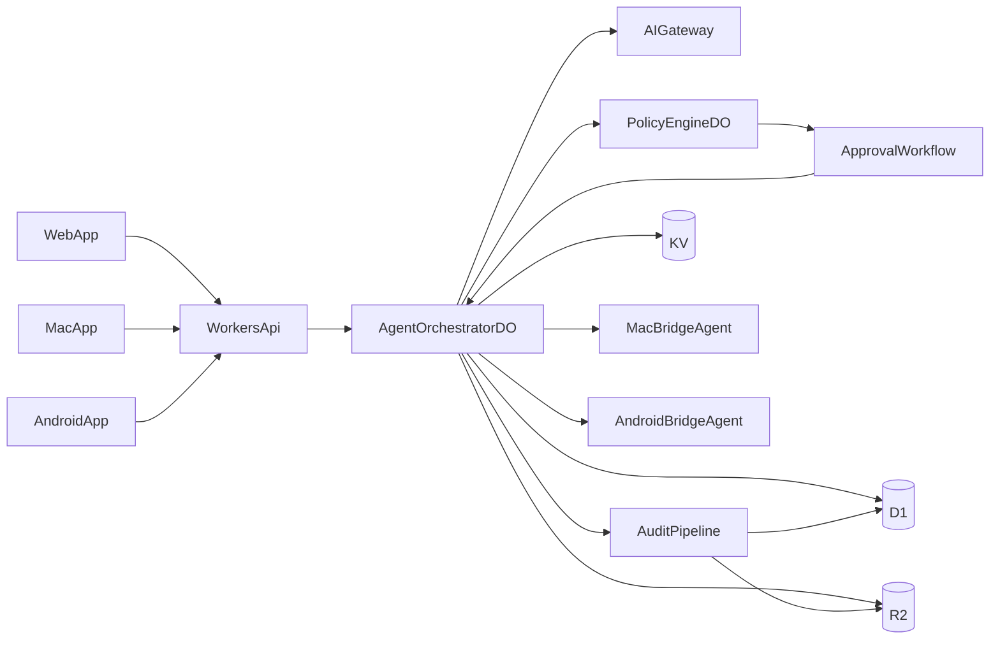

# Cloudflare-Native OpenClaw Plan

## Goal

Build a production-oriented Phase-1 platform where the central agent runtime/orchestration lives on Cloudflare, while local file actions run through trusted device bridges (Mac + Android) behind explicit guardrails.

## Inputs and References

- Baseline product philosophy and orchestration goals from [OpenClaw.md](/Users/amar/Codes/my_repos/sage/OpenClaw.md)
- Existing Cloudflare mapping notes from [architecture-cloudflare.md](/Users/amar/Codes/my_repos/sage/architecture-cloudflare.md)
- Cloudflare runtime model: Agents SDK + Durable Objects + Workflows
- LLM baseline: Agents SDK `Agent` classes call models via AI Gateway only (single governed egress path)
- Additional architecture references to borrow patterns from: LangGraph (durable graph execution), MCP (tool discovery/protocol), CrewAI-style role/tool scoping, human-in-the-loop approval frameworks

## Target Architecture (Phase-1)

## Core Design Decisions

- Cloudflare-first brain:
  - `AgentOrchestratorDO` owns session state, run state, tool intent lifecycle, websocket sync
  - Workers provide public API/auth ingress and route requests into DO
- LLM execution baseline:
  - Start with Agents SDK `Agent` methods for all orchestration and tool-calling loops
  - Route every LLM call through AI Gateway for centralized auth, logging, retries, fallback, and policy controls
  - Keep provider keys out of bridge apps; only Cloudflare backend can invoke model providers
- Privileged execution split:
  - Mac and Android each run a local bridge process/app that executes tool calls for that device
  - Web app remains a control surface only (no privileged local execution)
- Guardrails by default:
  - Deny-by-default policy for all tools
  - Mandatory approval for write/delete/exec/publish capabilities
  - Capability-scoped, short-lived tokens for every privileged action
- Durable async orchestration:
  - Workflows handle long-running approval waits, escalation, retries, and resumptions
- Data layering:
  - D1 for structured state (sessions, policy, approvals, audit index)
  - KV for TTL artifacts (nonces, short-lived capabilities, replay windows)
  - R2 for large payloads (diffs, artifacts, tool outputs, audit blobs)

## Security and Trust Model (Primary)

- Identity and auth:
  - Per-user identity + per-device identity with signed device registration
  - Device trust tiers (e.g., `trusted`, `restricted`) used in policy evaluation
- Tool permissioning:
  - Per-tool and per-resource scopes (e.g., file path allowlists, repo allowlists)
  - Action intents are normalized before policy check
- Approval gates:
  - Human approval artifacts are single-use, time-bound, bound to tool call hash + device + session
  - High-risk actions require explicit prompt with contextual diff/summary
- Request integrity:
  - Signed requests, nonce replay protection, timestamp windows
- Auditability:
  - Immutable event log with linked decision chain: `intent -> policy -> approval -> execution -> result`

## Delivery Plan

### Stage 0: Product Contract and Interface Specs

**Stage goal**

- Freeze shared contracts so cloud runtime and device clients can be built independently without protocol drift.

**Substeps**

- Define canonical schemas for `ToolIntent`, `PolicyDecision`, `ApprovalRequest`, `ExecutionReceipt`, and `AuditEvent`.
- Define websocket event taxonomy for all clients: `session.update`, `approval.requested`, `approval.resolved`, `tool.status`, `run.completed`, `error`.
- Define idempotency keys and correlation IDs for every request path.
- Define error envelope format with machine-readable `code`, `reason`, and `recoverable` fields.
- Define versioning strategy for schemas and events (`v1` namespaces + migration policy).

**Exit criteria**

- One versioned protocol spec document exists and is consumed by Web, Mac, Android, and cloud services.
- Contract tests validate that each client and backend component can parse/produce all `v1` events.

### Stage 1: Cloud Runtime Foundation (Agents SDK + AI Gateway)

**Stage goal**

- Bring up a minimal but production-safe cloud control plane that can run sessions and invoke LLMs through AI Gateway only.

**Substeps**

- Implement Worker ingress endpoints for auth bootstrap, session creation, websocket connect, and action submit.
- Implement `AgentOrchestratorDO` for session lifecycle, run lifecycle, and event fanout.
- Add persistence bindings and base tables/keys for D1, KV, and R2.
- Integrate AI Gateway as mandatory LLM egress with default timeout, retry, and provider fallback policy.
- Add request tracing (`requestId`, `sessionId`, `runId`) across Worker, DO, and AI Gateway calls.

**Exit criteria**

- A client can create a session, send a prompt, and receive streamed response events.
- All model calls are visible in AI Gateway logs and there are zero direct provider calls in code paths.

### Stage 2: Policy Engine and Approval Workflow

**Stage goal**

- Enforce deny-by-default control of all tool actions with deterministic policy and explicit approvals.

**Substeps**

- Implement `PolicyEngineDO` with ordered policy evaluation: global -> user -> device -> session -> tool.
- Define risk tiers (`low`, `medium`, `high`, `critical`) and map each tool action to a default tier.
- Implement approval creation/resolution workflow with TTL, single-use approval tokens, and cancellation rules.
- Connect approval state back into orchestration lifecycle so runs can pause/resume safely.
- Add AI Gateway boundary controls: model allowlist, route-level rate limits, fallback restrictions.

**Exit criteria**

- Any tool action without explicit allow policy is denied.
- High-risk actions pause until approval and resume correctly after decision.
- Policy and approval decisions are fully reflected in audit events.

### Stage 3: Mac and Android Bridge Executors

**Stage goal**

- Enable trusted local execution on Mac and Android with capability-scoped access and independent trust levels.

**Substeps**

- Implement bridge registration flow with device keys, signed challenge, and trust-tier assignment.
- Implement secure command channel from cloud orchestrator to bridge with nonce + timestamp validation.
- Implement Phase-1 tool set on both bridges: local file read, local file write, safe repo patch apply.
- Enforce path scopes and operation scopes locally (for example, allowed roots and write constraints).
- Implement bridge heartbeats, offline queue handling, and reconnect recovery.

**Exit criteria**

- Cloud can dispatch tool intents to either bridge and receive signed execution receipts.
- Unauthorized paths or operations are rejected locally and logged to cloud audit pipeline.

### Stage 4: Controlled Developer Workflows and Publishing

**Stage goal**

- Convert raw tool capabilities into user-safe workflows for code edits and tool publishing.

**Substeps**

- Implement proposal-first code workflow: analyze -> generate patch -> summarize risk -> request approval -> apply.
- Add diff-aware approval views in Web/Mac/Android to support informed decisions.
- Implement rollback metadata for every applied patch (snapshot pointer + reversal recipe).
- Define tool publishing workflow: metadata validation, static checks, policy check, approval gate, publish.
- Add per-workflow policy templates (strict, balanced, trusted-device) to reduce configuration friction.

**Exit criteria**

- Code modification flow is fully audited and cannot bypass approval where policy requires it.
- Publishing workflow blocks unapproved or policy-noncompliant tool releases.

### Stage 5: Hardening, Abuse Resistance, and Ops Readiness

**Stage goal**

- Prepare system for stable daily use with strong observability, incident controls, and security verification.

**Substeps**

- Add quota and budget enforcement for sessions, tool invocations, and model spend.
- Add abuse protections: replay detection, anomaly alerts, lockout rules, and emergency kill switches.
- Implement audit export and retention strategy (D1 index + R2 archives).
- Add chaos and failure tests for offline bridges, duplicate events, delayed approvals, and provider outages.
- Build operator dashboards for approvals, denials, model usage, bridge trust health, and incident state.

**Exit criteria**

- Critical failure modes have runbooks and tested mitigations.
- Operator can detect, investigate, and contain risky behavior without taking the platform offline.

## What to Reuse from OpenClaw vs Rebuild

- Reuse concepts:
  - Session lifecycle, channel/device routing mindset, explicit safety defaults, extensibility boundaries
- Rebuild for Cloudflare:
  - Gateway runtime (replace single long-lived Node process with Workers+DO)
  - File-based persistence model (replace with D1/KV/R2)
  - Process-dependent tool paths (move to local bridge executors)
  - LLM invocation path (replace direct provider fanout with AI Gateway-governed egress)

## Success Criteria for Phase-1

- Agent brain stays fully cloud-hosted on Cloudflare
- All LLM invocations are made by Agents SDK runtime through AI Gateway (no direct provider calls from clients/bridges)
- Web/Mac/Android clients can observe and control the same session in real time
- Local file read/write on Mac and Android requires policy pass + approval where configured
- Every privileged action is traceable end-to-end in audit history
- Guardrail bypass attempts are rejected with clear operator-visible reasons
